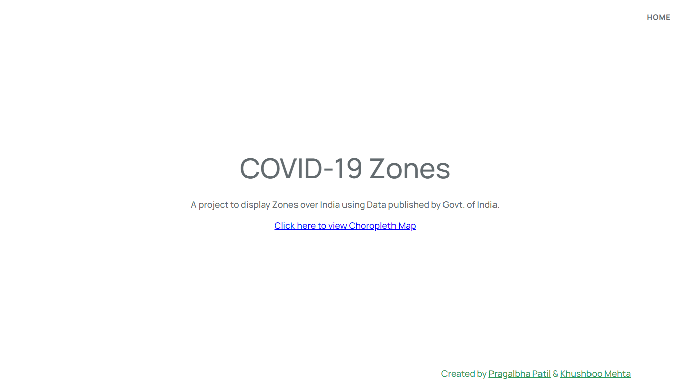
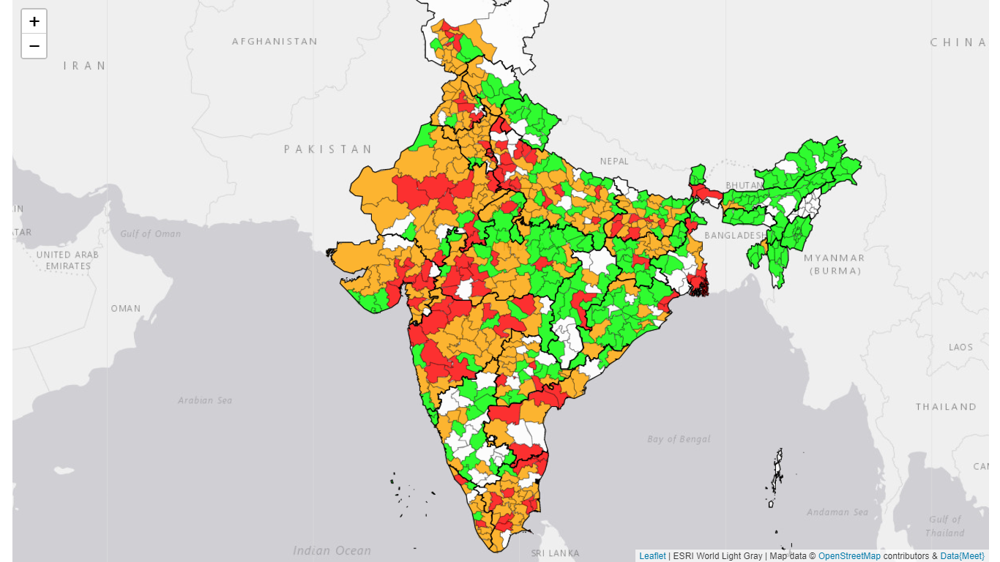

# COVID19-Zones

A project to display Zones over India using Data published by Govt. of India.

## Demo

---


## Installation
Clone the repo &
Use [Composer](https://getcomposer.org/download/) to setup the project.

```cmd
composer install
```
```cmd
cp .env.example .env
```
```cmd
php artisan migrate && php artisan key:generate
```

## Running the project

```cmd
php artisan serve
```

## Contributing
Pull requests are welcome. For major changes, please open an issue first to discuss what you would like to change.

## My social links
[Instagram](https://instagram.com/psp.jpg)

[Twitter](https://twitter.com/pragalbha77)
